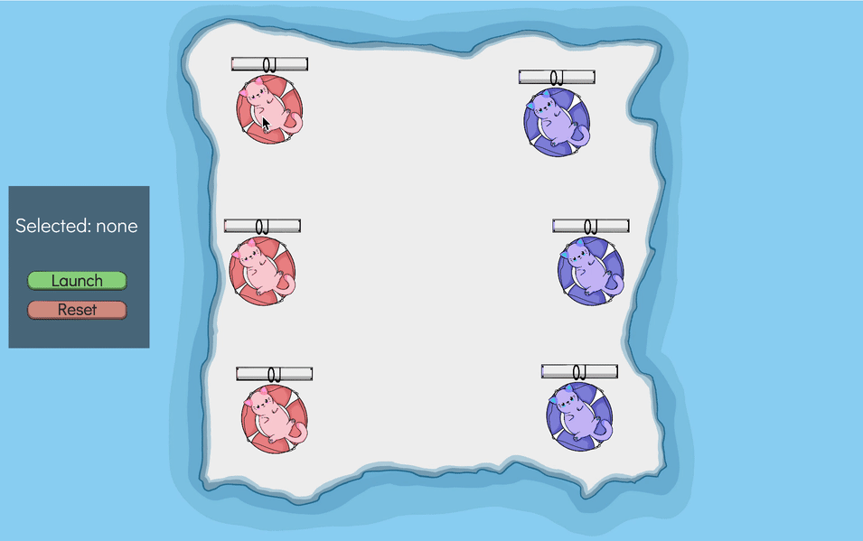

# Kitty Collisions
 A Unity app that models elastic collisions between cylindrical objects. Inspired by the "Knockout" GamePigeon game. This is my final project for AP Physics C: Mechanics.

Sprites drawn by project partner, Emma Randall-Jarrard.

## About
All collisions are modeled using Unity's Rigidbody physics system. In order to simulate realistic collisions, each cat is modeled as sitting on a 3D cyllindrical puck on a surface with variable friction. Collisions on the frictionless surface are assumed to be elastic, meaning mechanical energy is conserved before and after the collision. Collisions on the surfaces with friction are inelastic, meaning some kinetic energy is lost due to work done by friction.

## Hosting
The game is hosted on Netlify at https://kittycollisions.netlify.app/. Feel free to try it out!

 ## Demo
 
